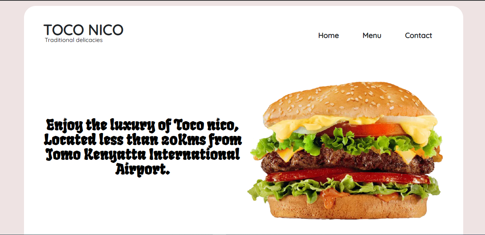
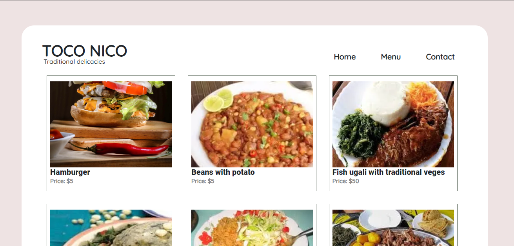

# Restaurant-page-JS
The main goal of this project is to show the understanding of the benefits of modularized code as well as the ability to set up a javascript application made of different modules using webpack.

## Screenshot

1. Home Page

2. Menu page

js-restaurant-page is a simple javascript application that shows three different sections which can be selected by the navigation bar. Every DOM element on the page is created from scratch with javascript and managed by webpack modules.

## Built With

- HTML 5 and CSS 3.
- Javascript
- Bootstrap
-Webpack

## Live Demo
[Live link](https://pedantic-pike-f0dd3d.netlify.app/)

## Authors

👤 **Hillarioh Okerio**

- Github: [@hillarioh](https://github.com/hillarioh)
- Twitter: [@hillaokri](https://twitter.com/hillaokri)
- Linkedin: [Hillarioh Okerio](www.linkedin.com/in/hillaryokerio)
- Email: (okerioh@gmail.com)

## 🤝 Contributing

Contributions, issues and feature requests are welcome!

## Show your support

Give a ⭐️ if you like this project!

## 📝 License

This project is [MIT](./LICENSE) licensed.

